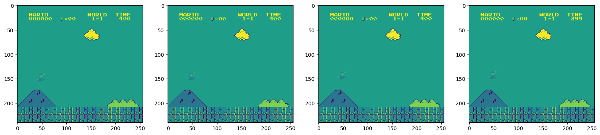

# Super Mario RL

This is a simple AI PPO model to play to Super Mario Bros with Python using packages like:
- [gym-super-mario-bros](https://pypi.org/project/gym-super-mario-bros/).
- [nes-py](https://pypi.org/project/nes-py/).
- [PyTorch](https://pytorch.org/).
- [Stable-Baselines3](https://stable-baselines3.readthedocs.io/en/master/).

This project is based on [this tutorial](https://www.youtube.com/watch?v=2eeYqJ0uBKE) by Nicholas Renotte.

> For more information, please read the comments on the notebook.

